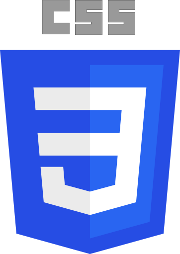

[[RU]](https://github.com/timius100/timius100/blob/main/README_RU.md)

## Hi, I'm Timur 👋

### About me
- 🏙 I live in Latvia, I know Russian and English, but I don't know Latvian...
- 🎂 I am under 18, and my birthday is April 7

### What am I doing
- 🌱 I'm learning Unity and Blender, because I want to model and create cool games

## Languages and tools I know 🛠

### Languages

### Tools

## Statistics

## Contact me
- 🎮 Discord: _hu_tao
- 💬 VK: <https://vk.com/tbogdanov96>
